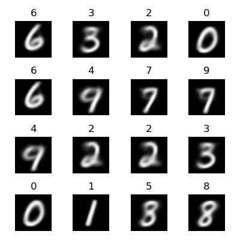
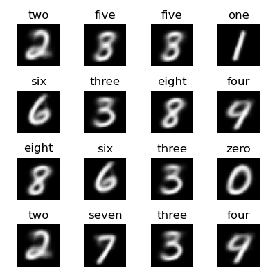
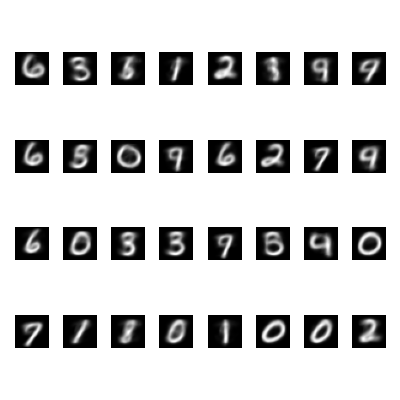
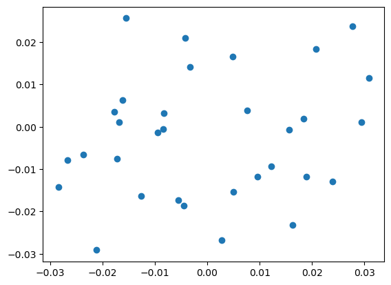
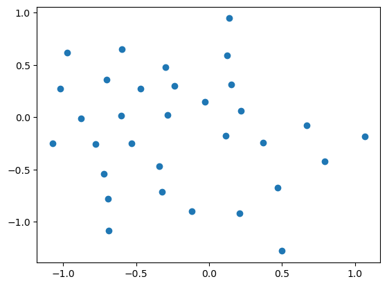
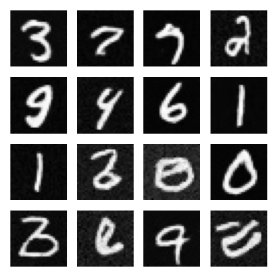
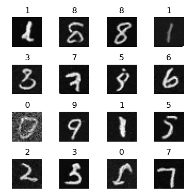
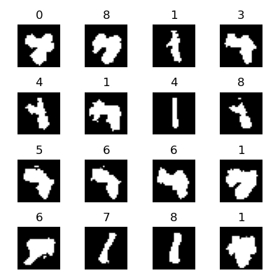

# AIGC Generative Models

For NLP generative, like GPT, please check https://github.com/rmgogogo/nano-transformers

Here this repo more on generatives. GPT still may be tried here.

This repo uses PyTorch.

## VAE

```
python vae.py --train --epochs 10 --predict
```


## Conditional VAE

```
python cvae.py --train --epochs 10 --predict
```


## Diffusion

```
python diffusion.py --train --epochs 100 --predict
```

Mac Mini M1 takes around 1 hour (1:17:16).


## Conditional Diffusion

```
python conditional_diffusion.py --train --epochs 100 --predict
```


## CLIP

```
python clip.py --train --epochs 10 --predict
```



## CLIP Pro

A pro version of CLIP. It uses the BERT text encoder with real text.
Since this is a nano image VAE, while BERT encoder generates 768-d vector, and we only have 10 ditigals, it has high prob to contain same digital in one batch, then the CLIP's loss can't work well. Using small batch would help but small batch has its own problem. So the performance is not good.
However it's good enough as a demo to tell the essience.

```
python clip_pro.py --train --epochs 10 --predict
```



## VQ VAE

```
python vqvae.py --train --epochs 100 --predict
```

Codebook size is 32, here display the whole possibilites. This sample VQ the whole z, in real case, it VQ the parts.



The initial codebook:



The learned codebook:



## DDIM (Faster Diffusion Generation)

50 times faster.

```
python diffusion.py --predict --ddim
python conditional_diffusion.py --predict --ddim
```





## Latent Diffusion

Based on vae with latent 8, it do diffusion in latent space.
However since the latent space already is noise-make-sense and high compressed (8 numbers), the diffusion in latent didn't work well as expected.
It's mainly for demo purpose.

