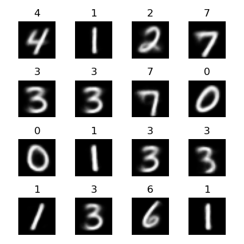

# AIGC Generative Models

For NLP generative, like GPT, please check https://github.com/rmgogogo/nano-transformers

Here this repo more on generatives. GPT still may be tried here.

This repo uses PyTorch.

## VAE

```
python vae.py --train --epochs 10 --predict
```


## Conditional VAE

```
python cvae.py --train --epochs 10 --predict
```



## Diffusion

```
python diffusion.py --train --epochs 100 --predict
```

Mac Mini M1 takes around 1 hour (1:17:16).


## Conditional Diffusion

```
python conditional_diffusion.py --train --epochs 100 --predict
```


## CLIP

```
python clip.py --train --epochs 10 --predict
```


## CLIP Pro

A pro version of CLIP. It uses the BERT text encoder with real text.
Since this is a nano image VAE, while BERT encoder generates 768-d vector, it's expected that it's not good like one-hot.
However it's good enough as a demo.

```
python clip_pro.py --train --epochs 10 --predict
```

