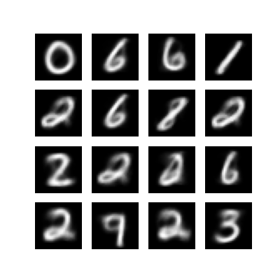
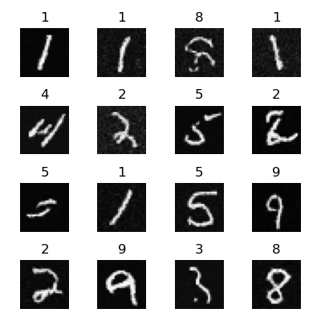

# AIGC Generative Models

For NLP generative, like GPT, please check https://github.com/rmgogogo/nano-transformers

Here this repo more on generatives. GPT still may be tried here.

This repo uses PyTorch.

## VAE

```
python vae.py --train --epochs 10 --predict
```



## Conditional VAE

```
python cvae.py --train --epochs 10 --predict
```


## Diffusion without time embedding

If diffusion has 1000 steps, each image should have 1000 steps for one epochs. So here the epoch parameter is the not the real epoch. The real epoch is the `epochs / n_steps`.

```
python diffusion_no_te.py --train --epochs 100 --predict
```


## Diffusion

```
python diffusion.py --train --epochs 100 --predict
```

Mac Mini M1 takes around 1 hour (1:17:16).


## Conditional Diffusion

```
python conditional_diffusion.py --train --epochs 100 --predict
```

